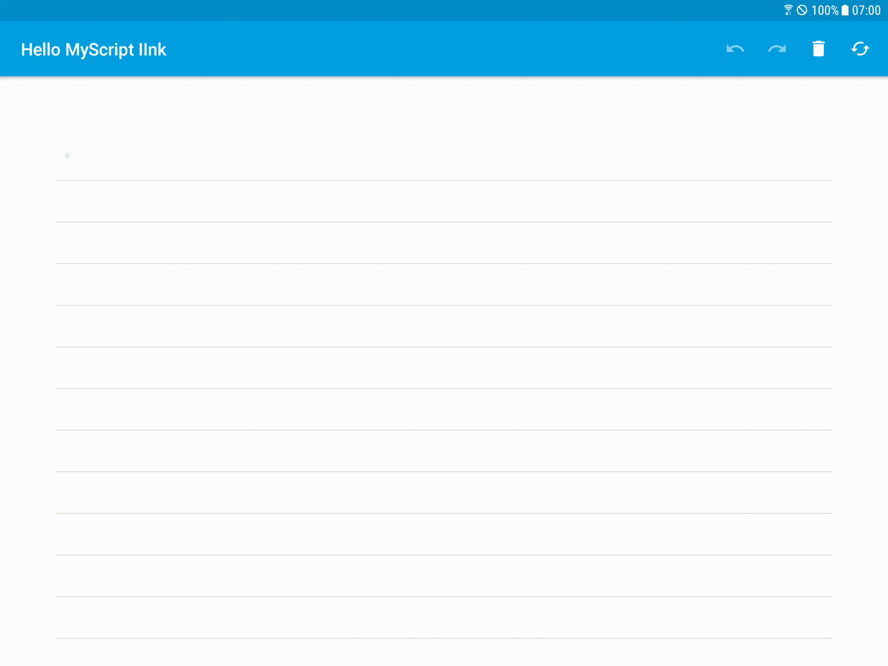
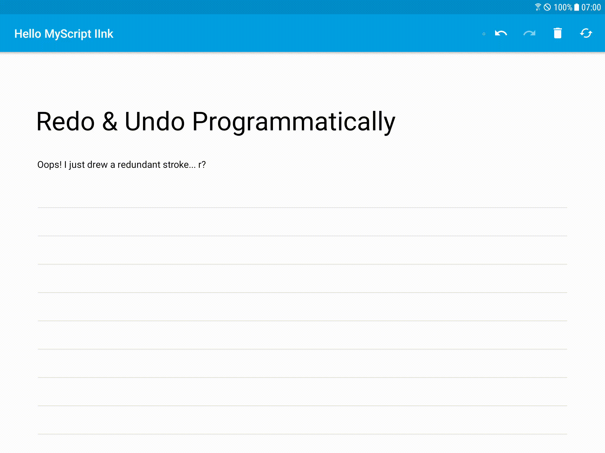
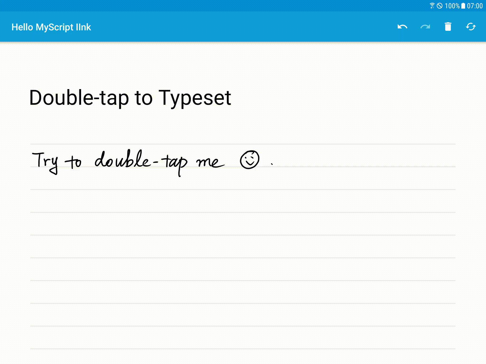
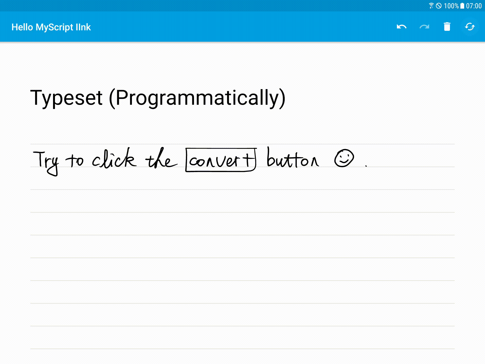

Get Started: Your First Interactive Ink Application
===================================================

In this pratical, you'll learn how to create and run our first Interactive Ink (abbr. as **IInk** in the following context) application from the [scaffold](https://github.com/jingkecn/myscript-iink-scaffold-android-kotlin):

- [Get Started: Your First Interactive Ink Application](#get-started-your-first-interactive-ink-application)
  - [App Preview](#app-preview)
  - [IInk Engine](#iink-engine)
  - [Your First Editor View](#your-first-editor-view)
  - [Interactivities](#interactivities)
  - [Summary](#summary)

> [!ATTENTION]
> In this practical, it is assumed that you have basic fundermentals of Android development (Kotlin).

App Preview
-----------

This simple application displays a page with guidlines, where you can write with your active pen or finger, and get the recognized result showing above your handwriting ink.

Here is what the final app will look like:



IInk Engine
-----------

An IInk application works with an [`Engine`](https://developer.myscript.com/docs/interactive-ink/1.3/android/fundamentals/interactive-ink-runtime/) object, the runtime of MyScript IInk SDK.

> [!ATTENTION]
> Please make sure you manage to run your app with a valid certificate. If not, please follow the instructions of [IInk Certificate](#iink-certificate) section.

The scaffold has instantiated an IInk engine for you in [`InteractiveInkApplication`](../common/src/main/java/com/myscript/iink/app/common/InteractiveInkApplication.kt).

Let the engine create a `ContentPackage`:

```kotlin
// create a content package package.
val packageFile = File("my_iink_package.iink")
try {
  contentPackage = createPackage(packageFile)?.let {
    // create a content part.
    contentPart = it.createPart("Text Document")
  }
} catch (e: Exception) {
  Log.e(TAG, "Failed to open package [$packageFile].", e)
}
```

As you can see in code, besides the configurations of `Engine`, a `ContentPackage` and a `ContentPart` are also created. In fact, IInk SDK works with a strutural storage, as stated in the official [docs](https://developer.myscript.com/docs/interactive-ink/1.3/android/fundamentals/storage/):

> `ContentPackage`:
> A **package** is a container storing ink and its interpretation as an ordered collection of parts.
> It can be saved as a file on the file system and later reloaded or shared between users.
>
> `ContentPart`:
> A **part** corresponds to a standalone content unit that can be processed by iink SDK.
>
> [!TIPS]
> You can change the part type on the creation of the `ContentPart` to try different recognitions, as is suggested in the code comments.
>
> More details about supported **content part types** refers to [MyScript Developer](https://developer.myscript.com/docs/interactive-ink/1.3/overview/content-types/#supported-content-types).

Your First Editor View
----------------------

The user interface (UI) of an IInk application consists of one or multiple [`EditorView`](https://github.com/MyScript/interactive-ink-examples-android/blob/master/UIReferenceImplementation/src/main/java/com/myscript/iink/uireferenceimplementation/EditorView.java)s implemented in `:myscript-iink` module. This is the official implementation of MyScript IInk [samples](https://github.com/MyScript/interactive-ink-examples-android) for Android, and you are [encouraged](https://developer.myscript.com/docs/interactive-ink/1.3/android/fundamentals/rendering/#reference-implementation) by MyScript to use directly the UI implementations of IInk.

Include `editor_view` into the root layout:

```xml
<!-- activity_main.xml -->
<include layout="@layout/editor_view" />
```

Then initialize the `EditorView` in [`MainActivity`](app/starter/src/main/java/com/myscript/iink/app/starter/activities/MainActivity.kt):

```kotlin
/* MainActivity.kt */
private lateinit var editorView: EditorView

override fun onCreate(savedInstanceState: Bundle?) {
  // ...
  editorView = findViewById<EditorView>(R.id.editor_view).also { init(it) }
}

private fun init(view: EditorView) {
  // TODO: initialize the editor view.
}
```

> [!INFO]
> Here we save the `EditorView` instance for later usage.

To initialize the `EditorView`, you'll have to:

1 - plug the `Engine` into the `EditorView`:

```kotlin
/* MainActivity.kt */
engine?.let { editorView.setEngine(it) }
```

2 - Initialize input mode:

```kotlin
/* MainActivity.kt */
editorView.inputMode = InputController.INPUT_MODE_AUTO
```

There are several input modes implemented in [`InputController`](https://github.com/MyScript/interactive-ink-examples-android/blob/master/UIReferenceImplementation/src/main/java/com/myscript/iink/uireferenceimplementation/InputController.java) in the module [`:myscript-iink`](https://github.com/MyScript/interactive-ink-examples-android/tree/master/UIReferenceImplementation):

- [`INPUT_MODE_FORCE_PEN`](https://github.com/MyScript/interactive-ink-examples-android/blob/master/UIReferenceImplementation/src/main/java/com/myscript/iink/uireferenceimplementation/InputController.java#L26): the `InputController` will behave as if all user input were **pen** input.
- [`INPUT_MODE_FORCE_TOUCH`](https://github.com/MyScript/interactive-ink-examples-android/blob/master/UIReferenceImplementation/src/main/java/com/myscript/iink/uireferenceimplementation/InputController.java#L27): the `InputController` will behave as if all user input were **touch** input.
- [`INPUT_MODE_AUTO`](https://github.com/MyScript/interactive-ink-examples-android/blob/master/UIReferenceImplementation/src/main/java/com/myscript/iink/uireferenceimplementation/InputController.java#L28): the `InputController` will automatically behave according to the `pen` or `touch` user pointer input.

> [!WARNING]
> [`InputController`](https://github.com/MyScript/interactive-ink-examples-android/blob/master/UIReferenceImplementation/src/main/java/com/myscript/iink/uireferenceimplementation/InputController.java) has also implemented another input mode [`INPUT_MODE_NONE`](https://github.com/MyScript/interactive-ink-examples-android/blob/master/UIReferenceImplementation/src/main/java/com/myscript/iink/uireferenceimplementation/InputController.java#L25), however, it actually results in the same behaviors as [`INPUT_MODE_AUTO`](https://github.com/MyScript/interactive-ink-examples-android/blob/master/UIReferenceImplementation/src/main/java/com/myscript/iink/uireferenceimplementation/InputController.java#L28).
>
> [!INFO]
> If you have any further question about it, please go contact the MyScript IInk SDK team or [fire an issue](https://github.com/MyScript/interactive-ink-examples-android/issues/new) under the official repository.
>
> If you have a better idea fixing this, please **fork** [their repository](https://github.com/MyScript/interactive-ink-examples-android) and make a [pull request](https://github.com/MyScript/interactive-ink-examples-android/pulls) to them.

3 - Attach the `ContentPart` to the [`Editor`](https://developer.myscript.com/docs/interactive-ink/1.3/android/fundamentals/editing/#editor-level-configuration) of the `EditorView`:

```kotlin
/* MainActivity.kt */
editorView.editor?.part = contentPart
```

4 - Visualize the `EditorView`:

```kotlin
/* MainActivity.kt */
editorView.visibility = View.VISIBLE
```

> [!INFO]
> The `EditorView` is set [invisible](https://github.com/MyScript/interactive-ink-examples-android/blob/master/UIReferenceImplementation/src/main/res/layout/editor_view.xml#L9) by default in the layout `editor_view.xml`.

Now build and run your app, then you'll be able to interact with MyScript IInk, like the [preview](#app-preview) at the beginning of this pratical.

Interactivities
---------------

By default, MyScript IInk provides the following gestures for editing (images from the official [docs](https://developer.myscript.com/docs/concepts/editing-gestures/)):

| Gesture   | Preview                                                                                                                              |
| --------- | ------------------------------------------------------------------------------------------------------------------------------------ |
| Erase     |                                                                                   |
| Break     |        |
| Join      |            |
| Highlight |                                                                               |
| Empasis   |  |

These gestures can satisty most of editing needs. You can play with these gestures in the application you create in this pratical.

> [!ATTENTION]
> Not all editing gestures are compatible for all types of content. Please check compatibilities in official [docs](https://developer.myscript.com/docs/interactive-ink/1.3/overview/gestures/).
>
> [!PS]
> To non-European friends: a **`×`** means **`compatible`** in the [table](https://developer.myscript.com/docs/interactive-ink/1.3/overview/gestures/), don't be confused.

Besides, there are 4 other editings:

| Editings                   | Preview                                                                         |
| -------------------------- | ------------------------------------------------------------------------------- |
| Clear                      |                         |
| Redo & Undo                |                     |
| Typeset (Double-tap)       |              |
| Typeset (Programmatically) |  |

```kotlin
editorView.editor?.let {
  // wait for the editor to be idle.
  if (!it.isIdle) it.waitForIdle()
  // convert all you handwrtten content into typeset result.
  it.convert() // see [!ATTENTION] section below.
  // undo your modifications if any
  if (it.canUndo) it.undo()
  // redo your modifications if any
  if (it.canRedo) it.redo()
  // clear all your content
  it.clear()
}
```

> [!ATTENTION]
> The API [`Editor.convert()`](../../iink/extensions/src/main/java/com/myscript/iink/extensions/Editor.kt#L9) is not an official API but an [extension function](https://kotlinlang.org/docs/reference/extensions.html#extension-functions) created in this pratical, this extension API will be used instead of the official API [Editor.convert(ContentBlock, ConversionState)](https://developer.myscript.com/refguides/interactive-ink/android/1.3/com/myscript/iink/Editor.html#convert-com.myscript.iink.ContentBlock-com.myscript.iink.ConversionState-) for tentative comprehension.

```kotlin
fun Editor.convert() =
  getSupportedTargetConversionStates(null).firstOrNull()?.let { convert(null, it) }
```

Summary
-------

- All interactive ink applications are driven by an [`Engine`](https://developer.myscript.com/docs/interactive-ink/1.3/android/fundamentals/interactive-ink-runtime/), whose initialization requires a valid, active [certificate](https://developer.myscript.com/getting-started).
- All interactive ink UI requires an [`EditorView`](https://github.com/MyScript/interactive-ink-examples-android/blob/master/UIReferenceImplementation/src/main/java/com/myscript/iink/uireferenceimplementation/EditorView.java) with a minum basic implementations of interactive ink, each `EditorView` owns an [`Editor`](https://developer.myscript.com/docs/interactive-ink/1.3/android/fundamentals/editing/#editor-level-configuration) for manipulations of ink interactivities.
- The interactive ink `Editor` works with [`ContentPart`](https://developer.myscript.com/docs/interactive-ink/1.3/android/fundamentals/storage/#working-with-parts), which is created by a [`ContentPackage`](https://developer.myscript.com/docs/interactive-ink/1.3/android/fundamentals/storage/#working-with-packages) created by `Engine`.
- MyScript Interactive Ink SDK has default interactive [gestures](https://developer.myscript.com/docs/interactive-ink/1.3/overview/gestures/) integrated: **erase**, **break (words / lines)**, **join (words / lines)**, **highlight** and **emphasis (underline / double-underline)**, besides, the conversion is also interactable by double-tap on the handwritten ink, as long as the `touch` is activated for ink interactivity.
- There are also 2 editing stacks integrated in MyScript Interactive Ink SDK: **undo** and **redo**, which can be implemented via the corresponding APIs of [`Editor`](https://developer.myscript.com/refguides/interactive-ink/android/1.3/com/myscript/iink/Editor.html).
